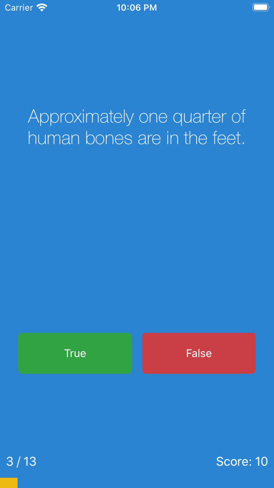

# Quizzler

It is an ios app named as Quizzler. There are static questions you can answer. Each true or false answer have a point inside the app. After finished answering questions you can restart it. 
Created using swift 4 and progres-hud framework used in this project.

